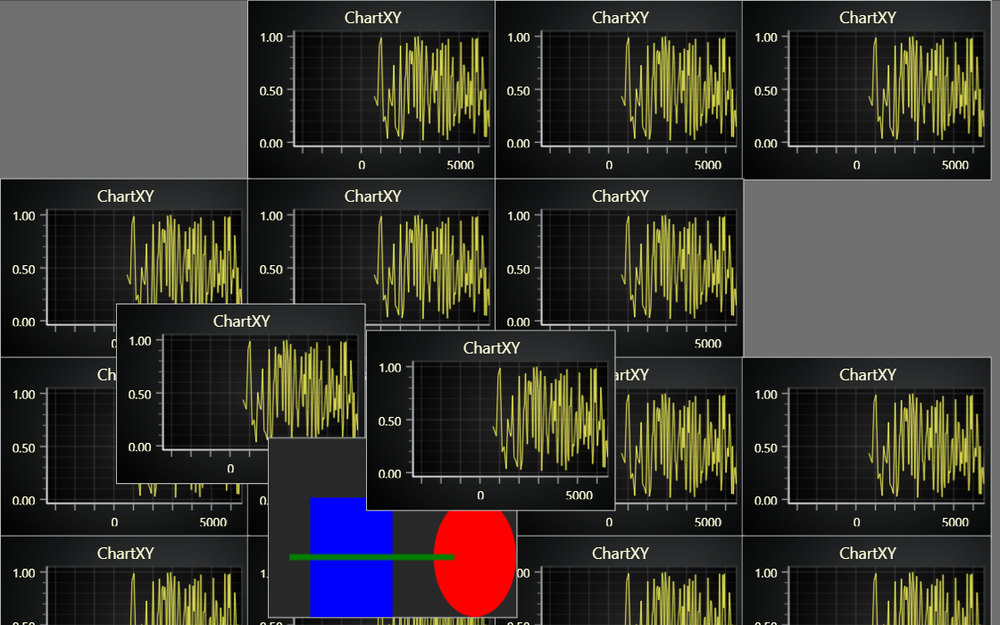

# JavaScript Multi Chart Canvas

This demo application belongs to the set of examples for LightningChart JS, data visualization library for JavaScript.

LightningChart JS is entirely GPU accelerated and performance optimized charting library for presenting massive amounts of data. It offers an easy way of creating sophisticated and interactive charts and adding them to your website or web application.

The demo can be used as an example or a seed project. Local execution requires the following steps:

-   Make sure that relevant version of [Node.js](https://nodejs.org/en/download/) is installed
-   Open the project folder in a terminal:

          npm install              # fetches dependencies
          npm start                # builds an application and starts the development server

-   The application is available at _http://localhost:8080_ in your browser, webpack-dev-server provides hot reload functionality.

## Description

Example of a freeform canvas where you can have any number of charts with free control over draw order and positioning.

LightningChart JS supports displaying virtually any number of charts on a single page. You can also freely position, size and overlay them with full control over draw order between charts and other HTML content.

In this example, 20 charts are placed all over the place with 1 HTML canvas element mixed in as an extra complication.
The page can be extended with a scroll bar, and any chart can be dragged around by holding down the mouse and moving. Dragging any panel will bring it to the top of draw order.

Meanwhile, all charts are receiving real-time streaming data and continue to operate normally in terms of panning, zooming and cursor interactions.

**Compared to other web browsers, this example performs extremely poorly on Mozilla Firefox** due to relatively bad implementation of `CanvasRenderingContext2D.drawImage` when source is another canvas element.

## API Links

* [Dashboard]
* [XY cartesian chart]
* [Line series]
* [Axis]
* [Axis tick strategies]
* [Axis scroll strategies]

## Support

If you notice an error in the example code, please open an issue on [GitHub][0] repository of the entire example.

Official [API documentation][1] can be found on [LightningChart][2] website.

If the docs and other materials do not solve your problem as well as implementation help is needed, ask on [StackOverflow][3] (tagged lightningchart).

If you think you found a bug in the LightningChart JavaScript library, please contact sales@lightningchart.com.

Direct developer email support can be purchased through a [Support Plan][4] or by contacting sales@lightningchart.com.

[0]: https://github.com/Arction/
[1]: https://lightningchart.com/lightningchart-js-api-documentation/
[2]: https://lightningchart.com
[3]: https://stackoverflow.com/questions/tagged/lightningchart
[4]: https://lightningchart.com/support-services/

© LightningChart Ltd 2009-2025. All rights reserved.

[Dashboard]: https://lightningchart.com/js-charts/api-documentation/v8.0.1/classes/Dashboard.html
[XY cartesian chart]: https://lightningchart.com/js-charts/api-documentation/v8.0.1/classes/ChartXY.html
[Line series]: https://lightningchart.com/js-charts/api-documentation/v8.0.1/
[Axis]: https://lightningchart.com/js-charts/api-documentation/v8.0.1/classes/Axis.html
[Axis tick strategies]: https://lightningchart.com/js-charts/api-documentation/v8.0.1/variables/AxisTickStrategies.html
[Axis scroll strategies]: https://lightningchart.com/js-charts/api-documentation/v8.0.1/variables/AxisScrollStrategies.html

